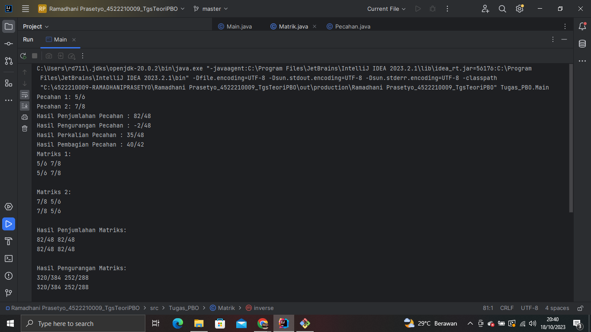
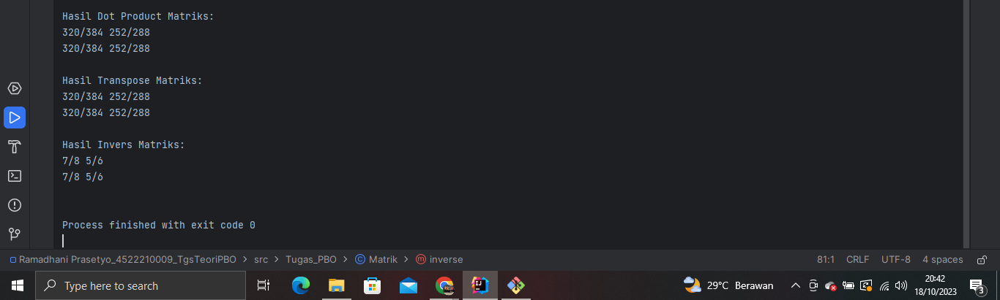

# TugasTeori_Pemrograman-Pecahan-Berorientasi-Objek_Operasi-Matriks
## RAMADHANI PRASETYO - 4522210009
### Membuat class Pecahan yang terdapat operasi:
- penjumlahan
- pengurangan
- perkalian
- pembagian
### Kemudian class Matrik yang elemennya Pecahan dengan operasi:
- penjumlahan matrik
- pengurangan matri
- dot matrik
- transpose matrik
- inverse matrik
## Capture Program

